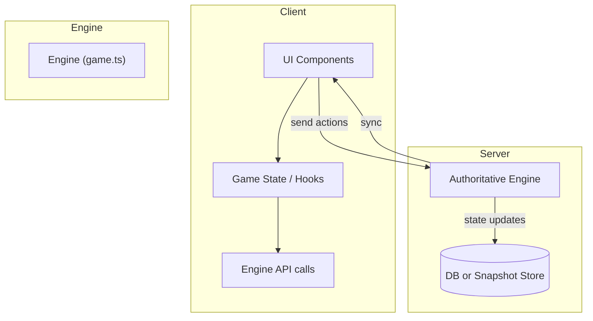
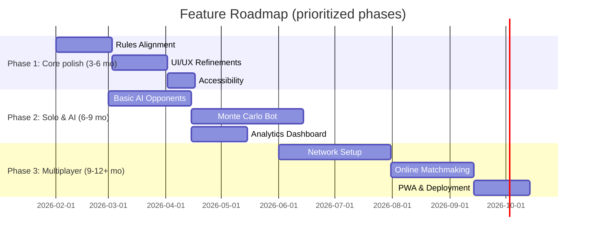

# Evolving a Digital Monopoly Deal Application: An Analytical Roadmap

**Enabled connector**: `GitHub` (repo: *EricCora/monopolyDeal*)  

## Executive Summary  

The *EricCora/monopolyDeal* codebase is a solid foundation: a pure rules engine (`src/engine`) and React UI (`src/ui`) with local persistence and stats dashboards【9†L23-L28】. It enforces core game invariants (e.g. 3 completed sets to win, 3-action turn limit, one active pending interaction)【9†L32-L40】. To evolve it into a polished, feature-rich app, we propose enhancements across ten categories. Key recommendations include: improving UI/UX clarity; adding rich animation/feedback; implementing AI opponents (from simple heuristics to advanced Monte Carlo/ISMCTS); enabling online multiplayer with an authoritative server; building out analytics and telemetry; ensuring accessibility; supporting custom rules/modding; hardening the software architecture; boosting replayability (daily challenges, achievements); and adding experimental features (explainable AI, spectator mode). Each category’s high-impact features, rationale, and difficulty are tabulated below. We also present a phased roadmap, highlight top features for hiring-appeal, retention, and developer enjoyment, and sketch mermaid diagrams for architecture and timelines.  

## Current Code Context and Constraints  

- **Rules Engine**: Core logic is in `src/engine/game.ts` and domain types in `src/engine/types.ts`【9†L23-L28】. Actions are applied via `applyAction()`, and legal moves are generated by `getLegalActions()`.  
- **UI Layer**: React + TypeScript with a main `App.tsx`, layout components (`GameShell`, `HandFan`, `PlayChooser`, `ActionRail`, etc.), and a stats dashboard using Recharts【9†L23-L28】.  
- **Persistence & Stats**: LocalStorage persistence (`src/persistence/storage.ts`) and stats models under `src/stats/`, keeping versioned records.  
- **Invariants**: The repo defines invariants to preserve (3 sets win, 7-card hand limit, one pending prompt at a time, etc.)【9†L32-L40】. These must not be broken by new features.  
- **Tech Stack** (unspecified beyond repo): Web (likely React/Vite), no explicit backend or networking.  

_Unstated constraints_ (treated as unspecified): platforms (assume web/PWA), licensing (unlicensed demo), scaling (likely small user count).  

## User Experience & Interaction Design  

High-impact features to improve usability, clarity, and onboarding:

| Feature                         | Why it helps                                      | Implementation Notes (repo anchors)                      | Difficulty |
|---------------------------------|---------------------------------------------------|----------------------------------------------------------|------------|
| **Interactive Tutorials/Onboarding**  | Eases new players into complex rules (Monopoly Deal has many actions). Guides prevent frustration. | Add tutorial mode overlay referencing `state.phase` and known prompts. Could piggyback on `pending` prompts in `game.ts`. Store progress in `uiPreferences`. | Medium |
| **Contextual Action Previews**       | Displays what an action will do (e.g. “Force one opponent to pay X”) before play. Reduces misclicks. | Build a lightweight “preview” of `applyAction` effects using structuredClone of state. Show info in a tooltip or side panel in `GameTableScreen.tsx`. | Medium |
| **Responsive Layouts**              | Improves play on varied screens (mobile vs desktop). Enhances clarity (player turn highlighting, adaptive hands). | Use CSS flexbox/grids in `src/ui/layout`. Possibly multiple table layouts (e.g. focus on current player). Maintain look in `GameShell.tsx`. | Easy/Medium |

_Visual assets_: Illustrative UI mockups would be very helpful (e.g. card layout, modal dialogs). Request images of “digital card game interface” and “Monopoly Deal hand UI” for inspiration.

## Game Feel & Visual Feedback  

Engaging feedback (“juice”) makes the game feel polished:

| Feature                  | Why it helps                                        | Implementation Notes                               | Difficulty |
|--------------------------|-----------------------------------------------------|---------------------------------------------------|------------|
| **Animations & Transitions**   | Smooth card dealing, moving cards to bank/sets, and discard animations add polish. | Leverage React transition groups or CSS animations in components (e.g. `HandFan.tsx`, `CardView.tsx`). Respect user “reduced motion” setting from `uiPreferences`. | Medium |
| **Sound & Haptics**            | Audio cues (card flip, coin sound) and vibration (on mobile) provide immediate feedback. | Integrate a small sound library, play on key events (bank payment, successful steal, etc.). Provide mute toggle. | Medium |
| **Rich Event Log UI**         | Grouping chained effects (rent → Just Say No → counter) in the log clarifies complex turns. | Enhance `RecentEvents.tsx` to collapse linked events and highlight active players. Possibly use colors or icons for action types. | Medium |

_Visual assets_: Example animations or particles for card games. Mermaid not needed here.

## AI Opponents & Decision Algorithms  

Players expect to play against bots. We recommend a tiered AI approach:

| Feature / Approach                 | Why it helps                                        | Implementation Notes                                   | Difficulty |
|------------------------------------|-----------------------------------------------------|--------------------------------------------------------|------------|
| **Heuristic AI (Basic)**           | Quick implementation; handles legal play. Good starter. | Add `src/ai/heuristic.ts`. Score actions by greedily advancing sets or maximizing bank value. Use `getLegalActions()` from engine. | Easy/Medium |
| **Monte Carlo Rollouts**           | Significantly stronger. Tests many random futures to pick good moves. | Implement a simulator (clone state and random-play) per candidate action. Use `structuredClone(state)` and random playouts to win/loss. Requires bounding sims for performance. | Hard |
| **Information-Set MCTS (ISMCTS)**  | Correctly handles hidden hands by sampling and averaging. State-of-art technique for card games. ([Cowling12](https://eprints.whiterose.ac.uk/75048/)) | Develop an ISMCTS framework: simulate with determinizations of opponents’ hidden cards. Build UCT tree over action sets. Complex to integrate but research-level AI. | Research-level |

_Table: Algorithm trade-offs (AI)_:

| Algorithm        | Strength                           | Weakness / Effort           | Typical Use       |
|------------------|------------------------------------|-----------------------------|-------------------|
| Heuristic        | Fast, explainable                  | Becomes predictable         | Casual mode       |
| Monte Carlo (MCTS) | Emergent strategy, handles luck   | Computation-heavy, simpler handling of hidden info (simulate with random decks) | Hard mode         |
| ISMCTS           | Proper uncertainty handling, strong play | Very complex; needs pruning; significant dev time | Expert mode |

## Multiplayer & Networking Architecture  

To support online play with hidden hands and fairness:

| Feature / Strategy                 | Why it helps                                          | Implementation Notes                                           | Difficulty |
|------------------------------------|-------------------------------------------------------|---------------------------------------------------------------|------------|
| **Server-Authoritative Model**     | Prevents cheating; allows hidden info management (server only sends each player’s hand). | Write a server (Node.js) mirroring the `engine` logic. Clients send actions; server validates via `getLegalActions` and updates state. Use WebSockets (RFC 6455) for real-time comms. | Hard |
| **Transport (Socket.IO vs. WebSocket)** | Robustness vs. control trade-offs.                  | Socket.IO offers built-in reconnection, fallbacks, and rooms; pure WebSocket (RFC 6455) is leaner but you must implement resync logic. For prototypes, Socket.IO is faster to build. | Medium |
| **Room/Matchmaking**               | Organizes games and players.                            | Use a library like Colyseus or a custom lobby system. Each room holds a game instance. Handle player disconnect by pausing or auto-playing. | Medium |

_Flow diagram (architecture)_:

```mermaid
flowchart TD
    subgraph Server
      A(HTTP Server / WebSocket) --> Engine([Engine: game.ts])
      Engine --> DB[/Snapshot & Stats/]
    end
    subgraph Client (React UI)
      C1(UI Screens) --> C2(Actions to Server)
      C1 <-- C3(UI Updates from Server)
    end
    C2 -- Socket.IO/WebSocket --> A
```

### Networking considerations:

- **State synchronization**: Send only diff or hand-tailored views (no hidden data leak).  
- **Latency**: Turn-based can tolerate moderate lag; still, handle race conditions (e.g. double-clicks).  
- **Persistence**: Consider server-side match persistence or reconnection tokens.  

## Analytics, Statistics & Player Insights  

Enhance retention with data and insights:

| Feature                       | Why it helps                                    | Implementation Notes                               | Difficulty |
|-------------------------------|-------------------------------------------------|---------------------------------------------------|------------|
| **Extended Telemetry**        | Understanding player behavior and imbalance helps tuning and shows professionalism. | Instrument key events (actions played, durations, mistakes). Use OpenTelemetry (OTel) to export traces/metrics. ([opentelemetry.io](https://opentelemetry.io/docs/languages/js/exporters/)) | Medium/Hard |
| **In-Game Metrics Display**   | Motivates players via feedback (e.g. win rate, longest combo). | Already has `StatsScreen`; add charts for average turn length, win streak, etc. Store new stats in `src/stats/records.ts`. | Medium |
| **A/B Testing Hooks**         | Improves future changes; cutting-edge product practice. | Feature-flagged changes to UI or rules; collect comparative metrics. Requires backend analytics support. | Research-level |

_Table: Tech options for telemetry_:

| Library/Framework    | Pros                               | Cons                         |
|---------------------|------------------------------------|------------------------------|
| OpenTelemetry (OTEL) | Standardized, vendor-agnostic      | More setup (collector needed) |
| Google Analytics    | Easy setup for front-end events    | Less control, privacy issues  |
| Custom (Firebase)   | Analytics + auth built-in          | Vendor lock-in, integration   |

## Accessibility & Usability  

Ensure the game is playable by all:

| Feature                   | Why it helps                                  | Implementation Notes                                   | Difficulty |
|---------------------------|-----------------------------------------------|--------------------------------------------------------|------------|
| **Keyboard Navigation**      | WCAG compliance; enables play without mouse. | Make all actions navigable: use arrow/tab to move focus through hand (`HandFan`), PlayChooser menu, ActionRail buttons. Apply ARIA roles (e.g. dialog).({“`[9†L32-L40]`”}, WAI-ARIA APG) | Hard |
| **Screen Reader Support**    | Inclusive design; improves UX for visually impaired. | Add ARIA labels to cards and buttons (e.g. “Play Move”, “Draw card”). Ensure announcements on pending prompts. | Medium |
| **High Contrast/Size Options** | Improves readability (WCAG 2.2).                | Provide theme toggle (dark mode, larger text). Ensure resize does not break layout. | Medium |

Reference: WCAG 2.2 and ARIA guidelines recommend clear focus states and multiple input methods【9†L32-L40】.

## Custom Rules & Modding Support  

Let users add variants:

| Feature                           | Why it helps                                    | Implementation Notes                                          | Difficulty |
|-----------------------------------|-------------------------------------------------|--------------------------------------------------------------|------------|
| **Configurable Rulesets**         | Players love house rules (e.g. 2-color wins, etc.). | Abstract critical numbers (winSets, maxHand) into a JSON `ruleset`. Load custom JSON at startup. Use a JSON Schema (Draft 2020-12) for validation. | Medium/Hard |
| **Custom Card Packs**             | Supports fan expansions or UI skins.             | Represent new cards as data (like `cards/catalog.ts`). Let JSON import. Cards with new actions must hook into engine (extend `types.ts`). | Hard |
| **Scriptable Effects (Mods)**     | Extreme flexibility, niche appeal.               | Provide a limited sandbox (e.g. WebAssembly or JS eval) to define new card behaviors. Very complex and risky (cheat opportunities). | Research-level |

_Table: Data vs. Code mods_:

| Approach             | Pros                           | Cons                       | Effort         |
|----------------------|--------------------------------|----------------------------|----------------|
| JSON-configurable    | Safe, easy to inspect          | Limited to pre-defined schema | Medium (dev new fields) |
| Scripting (JS/WASM)  | Extremely flexible             | Security, debugging issues  | Research (weeks) |

## Architecture & Software Engineering Improvements  

Strengthen the foundation:

| Feature / Practice                    | Why it helps                                | Implementation Notes                                         | Difficulty |
|---------------------------------------|---------------------------------------------|--------------------------------------------------------------|------------|
| **Separation of Concerns**             | Keeps engine pure, UI separate.              | Ensure no UI logic in `src/engine`. Use events/promises to decouple. The AGENTS guide stresses this【9†L32-L40】. | Medium |
| **Deterministic RNG**                 | Crucial for multiplayer sync and replay.    | Replace any `Math.random()` with a seeded PRNG (see `createGame(seed)`). Store RNG state in `GameState` to replay. | Medium |
| **Strong Typing & Testing**           | Prevents regressions, critical for a rule set. | Expand `src/test/` suite for every new rule. Use TypeScript for compile-time checks. | Easy/Medium |
| **Modular Engine (Library)**          | Allows reuse (e.g. potential mobile or AI bots). | Consider extracting engine as an NPM package. Already it’s separate `src/engine`. | Medium |
| **Service Worker / PWA**              | Improves offline playability, retention.     | Add Workbox (or Vite PWA plugin). Cache assets and API responses. | Medium |

## Replayability & Retention Features  

Keep players coming back:

| Feature                            | Why it helps                                      | Implementation Notes                                    | Difficulty |
|------------------------------------|---------------------------------------------------|---------------------------------------------------------|------------|
| **Daily / Weekly Challenges**        | Encourages habitual play; social sharing.         | Generate a seed and special objective (e.g. “Win in 5 turns”). Store high scores locally or via a leaderboard. | Medium |
| **Achievements / Mastery Levels**    | Taps into completion motivation (gamer psychology). | Track milestones (e.g. “10 wins”, “1000 cards banked”) in localStorage. Show badges in UI. | Medium |
| **Spectator / Turn Rewind Mode**     | Allows analyzing plays, fun to share highlights.   | Save full match log. Provide a time-slider UI to step through `history` events. (Engine logs events.) | Hard |

_Merit:_ “Fun” developer projects like replay mode also enhance learning and debugging.

## Experimental & “Push Boundaries” Features  

Innovative ideas to differentiate the product:

- **Explainable AI Coach** – After each move, suggest better play or explain success. Requires running AI simulations under the hood and natural-language hints. (Research-level, but very hiring-showcase-worthy.)  
- **Asynchronous Play / Tournaments** – Play moves at leisure, managing timelines and notifications. This involves turn-signing, a simple backend, and UI for incomplete games. (Complex but modern feature.)  
- **Augmented Reality (AR) Vision** – E.g. overlay card visuals on a real table via webcam. (Bleeding-edge, likely out of scope, but possible with WebXR APIs.)  

## Mermaid Diagrams  

**Architecture Overview:** Interactions between client UI, engine, and optional server.  


**Roadmap Timeline:** Sketch of phased milestones.  


## Prioritization & Highlight Features  

- **Top 3 Hiring-Manager-Impressive:** 
  1. Real-time server-authoritative multiplayer (network state sync & cheat resistance).  
  2. Research-grade AI (ISMCTS or explainable coaching).  
  3. End-to-end analytics pipeline with OpenTelemetry (showcasing observability skills).  

- **Top 3 Player-Retention:** 
  1. Daily challenges + leaderboards (habit building).  
  2. Achievement system (long-term goals).  
  3. Asynchronous play / multiplayer (“play with friends over time”).  

- **Top 3 Fun-to-Build:** 
  1. Time-travel replay mode with annotated highlights.  
  2. Explainable AI advisor that ‘coaches’ your play.  
  3. Custom rulebook editor and mod system (craft unique variants).  

## Recommended Sources & Next Steps  

- **Codebase (primary):** Inspect `src/engine` and `src/ui` thoroughly for extension points. Invariants in [AGENTS.md](9) are crucial guidelines.  
- **Official Rules:** Hasbro’s Monopoly Deal rulebook for card effects and edge cases. Also official Q&A clarifications (e.g. rent rules, houses/hotels).  
- **Game Design:** Research UX articles on digital card games (e.g. *RocketScience* blog on UI/UX for Hearthstone).  
- **Networking:** MDN WebSocket docs and tutorials on WebRTC vs Socket.IO for turn-based games. Colyseus (colyseus.io) if considering a framework.  
- **AI/ML:** Academic surveys on MCTS (e.g. [Browne et al. IEEE 2012]) and on imperfect-information search.  
- **Accessibility:** W3C ARIA Authoring Practices (dialog and listbox patterns) and WCAG 2.2 guidelines.  
- **Analytics:** OpenTelemetry documentation (opentelemetry.io) and Google’s web-vitals.  

An iterative implementation plan starts with stabilizing rules and UX, then adding AI, followed by multiplayer and polished features. The above tables and roadmap outline this phased approach. Good visual aids (UI mockups, interaction flow diagrams) would further clarify design; producing or requesting those is strongly encouraged.