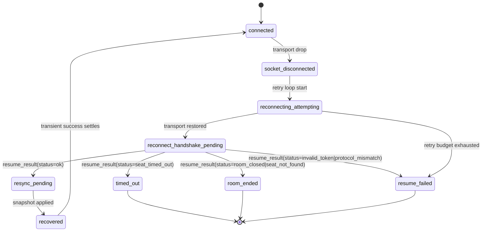

# Multiplayer Reconnect Contract (MD-C01)

Status: Draft for implementation and tracker check-off

Related:
- `docs/IMPLEMENTATION_TRACKER.md` (`Epic C — Reconnect/Resume Program`)
- GitHub tickets: `#20`, `#21`

## Terminology

- `seatId`: Stable, room-scoped player seat identifier. Canonical reconnect identity basis.
- `resumeToken`: Ephemeral per-seat reconnect credential.
- `legacy identity`: Existing `playerId` + `sessionToken` fields retained for compatibility.
- `grace window`: Time span where disconnected seats remain reclaimable.
- `authoritative snapshot`: Server-truth room/game state sent during reconnect recovery.

## Canonical Lifecycle States

- `connected`
- `socket_disconnected`
- `reconnecting_attempting`
- `reconnect_handshake_pending`
- `resync_pending`
- `recovered`
- `resume_failed`
- `timed_out`
- `room_ended`

### State Machine



## Seat Ownership Rules

- Seat identity is keyed by `seatId`, not display name.
- Reconnect auth uses per-seat `resumeToken`.
- Socket/session binding is separate from seat identity.
- Duplicate reconnect policy: newest valid reconnect wins and prior socket/session binding is invalidated.

## Grace Behavior

- Reconnect-v1 default grace: `90_000ms`.
- Grace is configurable (`MP_RECONNECT_GRACE_MS`) when reconnect-v1 is enabled.
- Legacy behavior remains at existing 5-minute grace while reconnect-v1 is disabled.

## Client Retry Policy (MD-C05)

- Reconnect-v1 client retry loop is bounded and single-flight.
- Attempt 1 is immediate, then exponential backoff with jitter:
  - `500ms`, `1_000ms`, `2_000ms`, `4_000ms`, `8_000ms` (capped at `8_000ms`).
  - Per-attempt jitter: `+/-20%`.
- Total reconnect retry budget: `30_000ms` from loop start.
- Retry loop only auto-retries transport failures (`request_failed`, `network_unavailable`).
- Stale terminal failures (`room_not_found`, `reconnect_expired`) clear session state and stop retry.
- Budget exhaustion transitions client UI to `resume_failed` and stops auto-retry until a successful refresh/join/host flow resets state.

## Duplicate Reconnect Policy

- If two active clients attempt reconnect for the same seat:
- Server accepts the newest valid request.
- Prior connection is invalidated and must reconnect again.
- Server emits presence/update event reflecting latest binding.

## Version Mismatch Policy

- Client sends `clientLastKnownStateVersion` (or equivalent revision) when resuming.
- If version diverges or client revision is stale, server requires full snapshot resync.
- Client must not accept gameplay input until snapshot is applied.

## Message Schemas

### Create/Join Response

```ts
{
  roomCode: string,
  seatId: string,
  resumeToken: string,
  // Compatibility:
  playerId: string,
  sessionToken: string,
  reconnectDeadlineMs: number
}
```

### Resume Request

```ts
{
  roomCode: string,
  seatId: string,
  resumeToken: string,
  clientLastKnownStateVersion?: number,
  expectedRevision?: number,
  // Compatibility:
  playerId?: string,
  sessionToken?: string
}
```

### Resume Result

```ts
{
  status: 'ok' | 'invalid_token' | 'seat_not_found' | 'room_closed' | 'seat_timed_out' | 'protocol_mismatch',
  roomCode: string,
  seatId?: string,
  requiresFullResync: boolean,
  serverStateVersion?: number,
  snapshot?: MultiplayerRoomView,
  resumeToken?: string,
  // Compatibility:
  playerId?: string,
  sessionToken?: string,
  reconnectDeadlineMs?: number,
  message?: string
}
```

MD-C06/MD-C07 implementation note:
- With `MP_RECONNECT_V1=true`, `/reconnect` returns HTTP `200` for handshake outcomes and carries status in payload.
- Successful handshake (`status='ok'`) includes canonical/legacy session credentials plus authoritative `snapshot`.
- Snapshot-in-handshake is the primary resync path; client falls back to `/state` fetch only if snapshot is missing.
- Legacy reconnect behavior (session-only success + 400-style failures) is preserved when reconnect-v1 flags are disabled.

### Presence Events

```ts
{
  event: 'mp:player_disconnected' | 'mp:player_reconnected' | 'mp:player_timed_out',
  roomCode: string,
  seatId: string,
  displayName: string,
  serverTime: number,
  graceExpiresAt?: number
}
```

MD-C03 implementation note:
- Server push events use `MultiplayerRoomEventEnvelope.reason` values:
  - `mp:player_disconnected`
  - `mp:player_reconnected`
  - `mp:player_timed_out`
- Optional envelope fields (`seatId`, `displayName`, `graceExpiresAt`) are included when available.

## Failure Modes and User Outcomes

| Failure | Server outcome | Client/UI outcome |
| --- | --- | --- |
| Invalid token | Reject resume (`invalid_token`) | `resume_failed`, show manual rejoin guidance |
| Seat timed out | Reject resume (`seat_timed_out`) | `timed_out`, require rejoin |
| Room closed/not found | Reject resume (`room_closed`/`seat_not_found`) | `room_ended`, route to host/join flow |
| Retry budget exhausted | No valid resume | `resume_failed`, allow retry/refresh/rejoin |
| Version mismatch | Resume accepted with resync required | `resync_pending` until snapshot applied |

### Server Status Mapping (Reconnect-v1)

| Internal error code | Handshake status |
| --- | --- |
| `invalid_session` | `invalid_token` |
| `reconnect_expired` | `seat_timed_out` |
| `revision_conflict` | `protocol_mismatch` |
| Room missing | `room_closed` |
| Other reconnect failures | `invalid_token` |

## Edge-Case Decision Table

| Scenario | Expected behavior |
| --- | --- |
| Refresh during own turn | Reconnect handshake then authoritative snapshot; only valid actor inputs enabled after resync |
| Refresh during opponent payment prompt | Reconnect + snapshot restores pending prompt state; non-actor cannot act |
| Disconnect then reconnect after grace timeout | Resume rejected as timed out; user must rejoin with room code |
| Duplicate tabs reconnect same seat | Newest valid reconnect owns seat; previous connection invalidated |

## Host Timeout Policy (MD-C10 Follow-On)

- For this slice, host-timeout behavior is specified but not fully implemented.
- Planned policy: pause room on host disconnect; resume if host reconnects in grace; end room if host times out.

## Explicit Decisions (Locked)

- Seat identity basis: `seatId`
- Reconnect auth: ephemeral `resumeToken`
- Grace default: `90_000ms` configurable
- Duplicate reconnect: newest socket/session wins, prior binding invalidated
- Host timeout behavior: specified in contract; implementation deferred to `MD-C10`

## Manual Simulation Scenarios (Spike validation)

1. Refresh during own turn.
2. Refresh during opponent payment prompt.
3. Disconnect and reconnect after grace timeout.
4. Duplicate tabs reconnecting the same seat.
