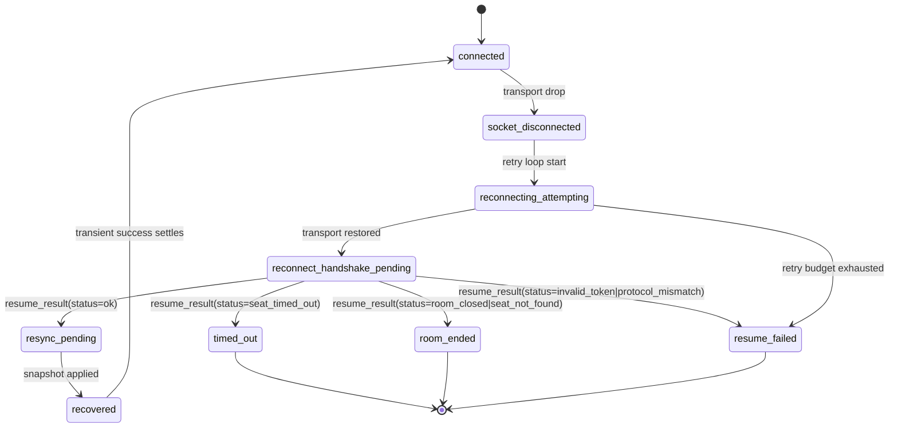

# Multiplayer Reconnect Contract (MD-C01)

Status: Active v1 contract (implemented through MD-C12 baseline slices, Socket.IO dual-stack rollout active)

Related:
- `docs/IMPLEMENTATION_TRACKER.md` (`Epic C — Reconnect/Resume Program`)
- GitHub tickets: `#20`, `#21`

## Terminology

- `seatId`: Stable, room-scoped player seat identifier. Canonical reconnect identity basis.
- `resumeToken`: Ephemeral per-seat reconnect credential.
- `legacy identity`: Existing `playerId` + `sessionToken` fields retained for compatibility.
- `grace window`: Time span where disconnected seats remain reclaimable.
- `authoritative snapshot`: Server-truth room/game state sent during reconnect recovery.

## Canonical Lifecycle States

- `connected`
- `socket_disconnected`
- `reconnecting_attempting`
- `reconnect_handshake_pending`
- `resync_pending`
- `recovered`
- `resume_failed`
- `timed_out`
- `room_ended`

### State Machine



## Seat Ownership Rules

- Seat identity is keyed by `seatId`, not display name.
- Reconnect auth uses per-seat `resumeToken`.
- Socket/session binding is separate from seat identity.
- Duplicate reconnect policy: newest valid reconnect wins and prior socket/session binding is invalidated.

## Grace Behavior

- Default reconnect grace: `90_000ms`.
- Grace is configurable via `MP_RECONNECT_GRACE_MS`.

## Client Retry Policy (MD-C05)

- Reconnect client retry loop is bounded and single-flight.
- Attempt 1 is immediate, then exponential backoff with jitter:
  - `500ms`, `1_000ms`, `2_000ms`, `4_000ms`, `8_000ms` (capped at `8_000ms`).
  - Per-attempt jitter: `+/-20%`.
- Total reconnect retry budget: `30_000ms` from loop start.
- Retry loop only auto-retries transport failures (`request_failed`, `network_unavailable`).
- Stale terminal failures (`room_not_found`, `reconnect_expired`) clear session state and stop retry.
- Budget exhaustion transitions client UI to `resume_failed` and stops auto-retry until a successful refresh/join/host flow resets state.

## Transport Contract (Dual-Stack)

- Primary realtime transport: Socket.IO (`room_update` event stream + typed command acks).
- Fallback realtime transport: SSE `/events` stream (same `room_update` envelope).
- Fallback mutation transport: HTTP REST endpoints (same request/response semantics).
- Client transport mode is observable as:
  - `socket_primary`
  - `http_fallback`

## Push Bootstrap Fallback (LAN/Safari hardening)

- Client enters `pushState='connecting'` while opening realtime updates.
- Client attempts Socket.IO push first.
- If socket push bootstrap is not established quickly, client falls back to SSE.
- Server emits an immediate `room_update` bootstrap frame (`reason='stream_bootstrap'`) when SSE opens.
- If push does not establish within `5_000ms`, client switches to polling fallback.
- Lobby status pill must settle to either:
  - `Live updates active`, or
  - `Live updates unavailable, using polling`.
- Client must never remain indefinitely in `Connecting live updates`.

## Duplicate Reconnect Policy

- If two active clients attempt reconnect for the same seat:
- Server accepts the newest valid request after reconnect authentication and grace-window checks succeed.
- A plain duplicate socket connection does not steal an already-connected seat; it is rejected until a valid reconnect handshake replaces the active binding.
- Prior connection is invalidated only after the replacement reconnect succeeds.
- Server emits presence/update event reflecting latest binding.

## Version Mismatch Policy

- Client sends `clientLastKnownStateVersion` (or equivalent revision) when resuming.
- A stale client revision is accepted and receives the authoritative snapshot; it is not a protocol mismatch.
- Client must not accept gameplay input until snapshot is applied.

## Message Schemas

### Create/Join Response

```ts
{
  roomCode: string,
  seatId: string,
  resumeToken: string,
  // Compatibility:
  playerId: string,
  sessionToken: string,
  reconnectDeadlineMs: number
}
```

### Resume Request

```ts
{
  roomCode: string,
  seatId: string,
  resumeToken: string,
  clientLastKnownStateVersion?: number,
  expectedRevision?: number,
  // Compatibility:
  playerId?: string,
  sessionToken?: string
}
```

### Resume Result

```ts
{
  status: 'ok' | 'invalid_token' | 'seat_not_found' | 'room_closed' | 'seat_timed_out' | 'protocol_mismatch',
  roomCode: string,
  seatId?: string,
  requiresFullResync: boolean,
  serverStateVersion?: number,
  snapshot?: MultiplayerRoomView,
  resumeToken?: string,
  // Compatibility:
  playerId?: string,
  sessionToken?: string,
  reconnectDeadlineMs?: number,
  message?: string
}
```

MD-C06/MD-C07 implementation note:
- `/reconnect` returns HTTP `200` for handshake outcomes and carries status in payload.
- Successful handshake (`status='ok'`) includes canonical/legacy session credentials plus authoritative `snapshot`.
- Snapshot-in-handshake is the primary resync path; client falls back to `/state` fetch only if snapshot is missing.

### Presence Events

```ts
{
  event: 'mp:player_disconnected' | 'mp:player_reconnected' | 'mp:player_timed_out',
  roomCode: string,
  seatId: string,
  displayName: string,
  serverTime: number,
  graceExpiresAt?: number
}
```

MD-C03 implementation note:
- Server push events use `MultiplayerRoomEventEnvelope.reason` values:
  - `mp:player_disconnected`
  - `mp:player_reconnected`
  - `mp:player_timed_out`
- Optional envelope fields (`seatId`, `displayName`, `graceExpiresAt`) are included when available.

### Socket Command Envelope

```ts
{
  ok: true,
  transport: 'socket',
  serverStateVersion?: number,
  payload: T
}
```

```ts
{
  ok: false,
  transport: 'socket',
  error: {
    code: string,
    message?: string,
    serverStateVersion?: number,
    requiresResync?: boolean
  }
}
```

### Room Runtime Events (MD-C10)

```ts
{
  event: 'mp:room_paused_disconnect' | 'mp:room_resumed_disconnect' | 'mp:room_ended_timeout',
  roomCode: string,
  revision: number,
  serverTime: number,
  eventId: number
}
```

Runtime-state fields surfaced in `MultiplayerRoomView`:

```ts
{
  roomRuntimeState?: 'active' | 'paused_disconnect' | 'paused_host_disconnect' | 'ended_timeout',
  pausedReason?: 'manual' | 'player_disconnect' | 'host_disconnect',
  endedReason?: 'host_timeout' | 'disconnect_timeout'
}
```

Policy behavior:

- Active room disconnect pauses gameplay; completed match results are preserved.
- Host disconnect enters `paused_host_disconnect`.
- Host reconnect before timeout resumes to `active` when no unresolved disconnect remains.
- If the match was already manually paused before the disconnect pause overlay, that manual pause is restored after the last disconnect resolves.
- An expired competitor retires. With at least two survivors, the match continues and an expired host is replaced. With one survivor, that player wins and the room enters `ended_timeout`.
- Retirement discards that player's cards and clears undo/checkpoint history. Pending interactions involving the retired seat are resolved or canceled; turn order skips that seat. Manual pause/resume cannot override outstanding disconnects.
- Gameplay revision is separate from the event sequence used by chat and presence. Authenticated exact retries are checked before gameplay revision validation and are bound to the seat and action payload.

### Action Submit (Version Guard v1)

```ts
{
  roomCode: string,
  seatId?: string,
  resumeToken?: string,
  // Compatibility:
  playerId?: string,
  sessionToken?: string,
  action: Action,
  expectedRevision?: number,
  clientStateVersion?: number,
  actionId?: string
}
```

### Action Rejected (Version Guard v1)

```ts
{
  error: 'action_rejected',
  reason: 'stale_state' | 'not_your_turn' | 'invalid_action' | 'prompt_mismatch',
  serverStateVersion: number,
  requiresResync: boolean,
  message?: string
}
```

MD-C09 implementation note:
- `stale_state` responses include `requiresResync=true`.
- Client immediately enters `resync_pending`, refreshes authoritative room state, then returns to connected flow.
- Duplicate `actionId` retries are idempotent (first apply wins; duplicate retries do not double-apply).

## Failure Modes and User Outcomes

| Failure | Server outcome | Client/UI outcome |
| --- | --- | --- |
| Invalid token | Reject resume (`invalid_token`) | `resume_failed`, show manual rejoin guidance |
| Seat timed out | Reject resume (`seat_timed_out`) | `timed_out`, require rejoin |
| Room closed/not found | Reject resume (`room_closed`/`seat_not_found`) | `room_ended`, route to host/join flow |
| Competitor timeout (`MD-C10`) | Retire the seat; end only with fewer than two survivors | Continue with remaining competitors or show final result |
| Retry budget exhausted | No valid resume | `resume_failed`, allow retry/refresh/rejoin |
| Version mismatch | Resume accepted with resync required | `resync_pending` until snapshot applied |
| Stale action submit (`MD-C09`) | Reject with `action_rejected(reason=stale_state)` | Client auto-resyncs and resumes without manual rejoin |

### Server Status Mapping

| Internal error code | Handshake status |
| --- | --- |
| `invalid_session` | `invalid_token` |
| `reconnect_expired` | `seat_timed_out` |
| Room missing | `room_closed` |
| Other reconnect failures | `invalid_token` |

## Edge-Case Decision Table

| Scenario | Expected behavior |
| --- | --- |
| Refresh during own turn | Reconnect handshake then authoritative snapshot; only valid actor inputs enabled after resync |
| Refresh during opponent payment prompt | Reconnect + snapshot restores pending prompt state; non-actor cannot act |
| Disconnect then reconnect after grace timeout | Resume rejected as timed out; user must rejoin with room code |
| Duplicate tabs reconnect same seat | Newest valid reconnect owns seat; previous connection invalidated |

## Host Timeout Policy (MD-C10)

- Room pause/end outcomes are explicit via runtime-state fields and room-runtime events.
- Host timeout is terminal only when one competitor remains; otherwise a surviving competitor becomes host and play continues.

## Explicit Decisions (Locked)

- Seat identity basis: `seatId`
- Reconnect auth: ephemeral `resumeToken`
- Grace default: `90_000ms` configurable
- Duplicate reconnect: newest socket/session wins, prior binding invalidated
- Timeout behavior: retire the expired seat; continue with at least two competitors, otherwise finish.

## Manual Simulation Scenarios (Spike validation)

1. Refresh during own turn.
2. Refresh during opponent payment prompt.
3. Disconnect and reconnect after grace timeout.
4. Duplicate tabs reconnecting the same seat.
